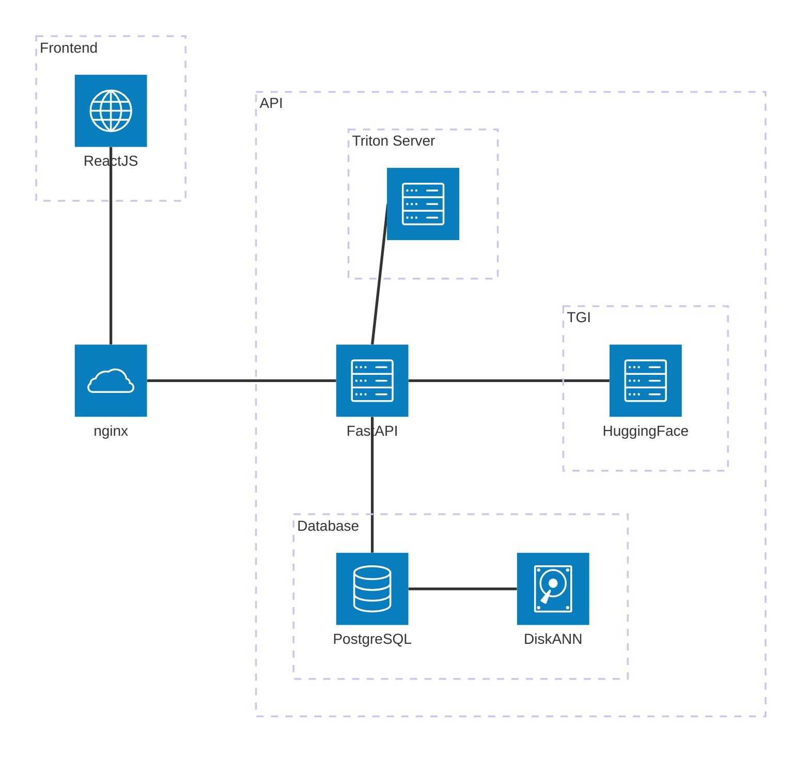

# Mousse

*MOUSSE* (**M**etadata f**O**cUsed **S**emantic **S**earch **E**ngine) is an innovative semantic search tool supercharged by cutting-edge Large Language Models (LLMs).
Designed to revolutionize data discovery, MOUSSE focuses on metadata, making it the perfect solution for navigating and unlocking the potential
of vast, diverse datasets — even those without structured ontologies.

## Overview

The **Mousse** platform consists of a **[React](https://react.dev)-powered UI** and a **[FastAPI](https://fastapi.tiangolo.com)-based REST API**. Metadata records are indexed in a **[PostgeSQL](https://www.postgresql.org) database**, utilizing:

- **[PostGIS](https://postgis.net)** for spatial indexing.
- **[pgvector](https://github.com/pgvector/pgvector)** for embedding-based vector indexing.
- A **timerange index** for efficient temporal searches.

A key challenge addressed by this solution is efficient applying **spatiotemporal and semantic filtering** on large datasets. This is achieved through a **dynamic query builder** that constructs SQL queries based on user input. However, PostGIS and pvgector indexes does not work together out of the box. To overcome this, a semantic index (**[pgvectorscale](https://github.com/timescale/pgvectorscale)**) has been implemented on top of pgvector by [TimescaleDB](https://www.timescale.com), enabling hybrid searches. This approach implements the **[diskANN algorithm](https://github.com/microsoft/DiskANN)**, leveraging SSD storage for indexing, rather than relying solely on in-memory semantic indexes, which often comes with high scalability costs.

### Intelligent Query Filtering

A standout feature of the platform is its **automatic detection of the spatial and temporal filters** based on user queries. This is powered by a lightweight, fast LLM, which is prompted to function as a **Name-Entity Recognition (NER) system**, specifically tuned for the project's needs. The NER system:

- Identifies **location- and datetime-related entities**.
- Maps **locations** to their corresponding country or list of countries.
- Converts **datetime entities** into structured time ranges or recurring epochs.

Users can manually adjust the detected filters, extending, refining, or removing them as needed.

## Components



The **Mousse** platform consists of multiple interconnected components, each responsible for a specific part of the system's functionality. The architecture follows a **microservices-based approach**, where different services handle API requests, frontend interactions, database operations, and AI-powered processing.

### Core Components

- **Frontend (ReactJS)**: The user interface is built with **ReactJS**, providing an interactive and dynamic experience. The [Leaflet](https://leafletjs.com) library is used for visualizing geospatial data, while [Redux](https://redux.js.org) manages state and facilitates communication between components through a universal store. The frontend interacts with the backend via an API gateway.

- **API Gateway (Nginx)**: Manages incoming requests and routes them to the appropriate backend service.

- **Backend API (FastAPI)**: The core REST API, built with FastAPI, handles business logic, user queries, and database interactions.

- **Database Layer (PostgreSQL + PostGIS + pgvector/pgvectorscale)**:
    - **PostgreSQL**: Stores metadata records and structured data.
    - **PostGIS**: Enables **geospatial indexing** for spatial queries.
    - **pgvector**: Supports **semantic searches** using vector embeddings.
    - **DiskANN (Disk-based Approximate Nearest Neighbor)**: Implements efficient **vector search indexing** with SSD-based storage for scalability and hydrid searches.

### Machine Learning & AI Components

- **Inference Server (NVIDIA Triton)**: Handles **ML model inference**, its role is to project a text query into the corresponding embedding.

- **LLM NER (Hugging Face TGI)**: A **Text Generation Inference (TGI)** server is used to parse and enhance user queries by extracting spatial and temporal information using a fine-tuned LLM-based NER system.

This architecture ensures efficient handling of **spatiotemporal and semantic queries**, leveraging **database indexing, ML inference, and a responsive API layer** for seamless user interactions.

## Deployment

A recipe for the project deployment is defined in the `docker-compose` YAML files. To get started, first copy the contents of the [.env.example](./.env.example) into `.env` and fill in the required information.

Then, build and start the deployment stack using the following commands:

```sh
docker compose -f docker-compose.yml -f docker-compose.production.yml build
```

and
```sh
docker compose -f docker-compose.yml -f docker-compose.production.yml up -d
```

### Database migrations
Once the system is running, the database must be updated to the latest migration state. This is handled by an ephemeral container, which can be executed with:
```sh
docker compose --profile manual run migrate
```

### Data ingestion
Data for ingestion should to be stored in (partitioned) Parquet files before being imported into the system. Currently, only specific attribute names are allowed for the core dataset fields, as shown in the following table:

| Attribute   | Description        | Type                       |
| ----------- | ------------------ | -------------------------- |
| id          | Unique id          | str                        |
| title       | Record title       | str                        |
| description | Record description | str                        |
| format      | Resources format   | str[]                      |
| type        | Record type        | Enum[simple, composed]     |
| keyword     | Associated keywords| str[]                      |
| when        | Time range         | obj<from, to>              |
| where       | Spatial extent     | obj<east,west,north,south> |
| mean_embeddings | Record embedding| float[]                   |

To ingest data into the database, a second ephemeral container id provided. Assuming the Parquet files are located in a directory with an absolute path `/path/to/parquet`, you can start the ingestion process with:
```sh
docker compose --profile manual run -v /path/to/parquet:/data ingest bulk /data
```

To ingest the lower dimensional vectors, run
```sh
docker compose --profile manual run -v /path/to/parquet:/data ingest lower-dim /data
```

### Development deployment

For development, **hot reloading** can be enabled by running:
```sh
docker compose up -d
```
This ensures that changes are automatically reflected without needing to restart the containers manually.
